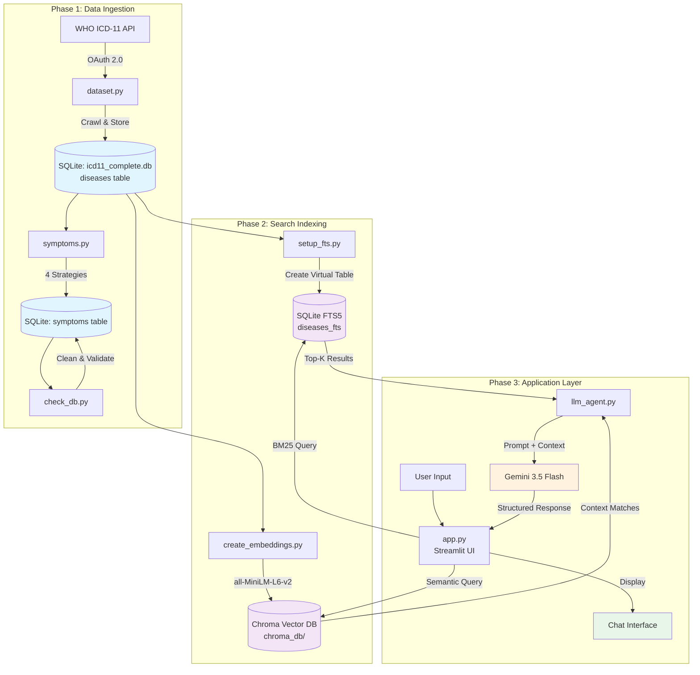
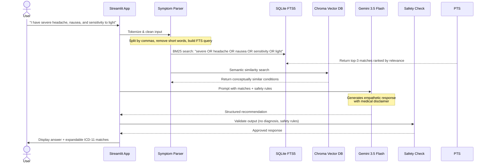

# 🩺 AI Medical Assistant & WHO ICD-11 Symptom Pipeline

An intelligent, professional AI Medical Assistant that combines the power of the **WHO ICD-11 (International Classification of Diseases)** database with the **Gemini 3.5 Flash LLM** to analyze user symptoms and provide structured medical insights.

This repository contains a full pipeline for authenticating with the WHO API, downloading and cleaning disease definitions and symptom entities, constructing a local relational database with search capability (FTS5 & Vector Store), and presenting the data through a polished chat interface.

---

## 🏗️ System Architecture

The system is built in three major phases: **Data Ingestion**, **Search Indexing**, and **Application Layer**.



---

## 🔄 Application Data Flow

When a user describes symptoms, the following pipeline executes:



---

## 🌟 Key Features

1. **WHO API Integration**: Seamless authentication and retrieval of disease and symptom entities from the official WHO ICD-11 API.
2. **Multi-Strategy Symptom Mining**: Extracts symptoms through 4 complementary strategies to build a comprehensive symptom database.
3. **Advanced DB Curation**: Sanitizes results using FTS rules and SQL constraints to eliminate laboratory/pathogen noise and autopsy reports.
4. **Hybrid Search Engines**:
   - **SQLite FTS5**: Blazing fast BM25 relevance ranking for keyword queries.
   - **Vector Semantics**: Chroma DB with `all-MiniLM-L6-v2` embeddings for conceptual queries.
5. **Generative RAG Loop**: Fuses search matches into a prompt context for **Gemini 3.5 Flash** to draft patient-facing recommendations.
6. **Interactive Streamlit Web UI**: Chat interface showing message history and expanders for exact ICD-11 database matches.
7. **Safety Guardrails**: The LLM is strictly instructed to avoid definitive diagnoses and always recommend professional medical consultation.

---

## 📂 Codebase File Structure

### Core Web App & LLM Interaction

| File | Purpose |
|------|---------|
| [`app.py`](app.py) | Main Streamlit web application. Handles the conversational UI, session state, and orchestrates the RAG pipeline (search → prompt → display). |
| [`llm_agent.py`](llm_agent.py) | Command-line test script that validates the full Gemini LLM search loop outside the web UI. |
| [`recommendation_agent.py`](recommendation_agent.py) | Standalone script demonstrating the FTS5 BM25 search engine. Shows top-K results with relevance scores. |

### Database & Search Indexing

| File | Purpose |
|------|---------|
| [`setup_fts.py`](setup_fts.py) | Creates the SQLite FTS5 virtual table `diseases_fts` and populates it from the `diseases` table. |
| [`create_embeddings.py`](create_embeddings.py) | Loads disease data, generates vector embeddings using `all-MiniLM-L6-v2`, and stores them in a local Chroma DB. |
| [`check_db.py`](check_db.py) | Post-processing validation script. Removes non-symptom entries (pathogens, lab results, autopsy mentions) and exports a clean CSV. |

### Data Pipelines & Ingestion

| File | Purpose |
|------|---------|
| [`dataset.py`](dataset.py) | WHO API crawler. Authenticates via OAuth2, recursively traverses the ICD-11 MMS linearization tree, and saves all disease entities to SQLite. |
| [`symptoms.py`](symptoms.py) | Multi-strategy symptom collector. Mines symptoms from Chapter 21 codes, disease definitions, a curated master list, and direct API crawling. |
| [`test_auth.py`](test_auth.py) | Lightweight diagnostic script to verify WHO OAuth credentials are working before running full crawlers. |

### Data & Environment

| File | Purpose |
|------|---------|
| `icd11_complete.db` | SQLite database containing the `diseases` table (~4,500+ entities), `symptoms` table, and `diseases_fts` virtual table. |
| `icd11_symptoms.csv` | Exported symptom list for inspection and debugging. |
| `.env.example` | Template for the Gemini API key configuration. |

---

## 🧠 Detailed Component Explanations

### 1. WHO API Authentication & Data Ingestion (`dataset.py`)

The WHO ICD-11 API uses OAuth 2.0 client credentials flow. This script:

1. **Authenticates** with the WHO Identity server using a client ID and secret to obtain a bearer token.
2. **Resumes crawling** from the MMS (Mortality and Morbidity Statistics) linearization root. It maintains a queue of URIs to visit and a `visited` set to avoid cycles.
3. **Extracts entities** from JSON-LD responses, normalizing fields like `title`, `code`, `definition`, `synonym`, `parent`, and `child`.
4. **Saves to SQLite** using `INSERT OR REPLACE` to support resume capability (skipping already-downloaded records).
5. **Handles token expiry** (401) and rate limits (429) with automatic retry logic.
6. **Exports to CSV** for backup and inspection.

> **Note**: The WHO credentials are currently hardcoded in the script. For production use, these should be moved to environment variables.

### 2. Symptom Mining Pipeline (`symptoms.py`)

This is the core data engineering component. It builds a robust `symptoms` table using four non-redundant strategies:

#### Strategy 1: Extract from Existing Diseases DB
- **Part A**: Queries the `diseases` table for entities with ICD-11 Chapter 21 codes (prefixes `MA` through `MH`). These are the official symptom/sign entities in the ICD-11 classification.
- **Part B**: Searches disease names for symptom keywords (e.g., "fever", "pain", "nausea") to catch symptom-like entities that may live outside Chapter 21.

#### Strategy 2: Mine Disease Definitions
- Loads all 4,500+ disease definitions.
- Applies two extraction methods:
  - **Vocabulary matching**: Checks if known clinical terms (from a 300+ term vocabulary) appear in the definition text.
  - **Pattern-based extraction**: Uses regex patterns to find phrases following patterns like "presents with...", "characterized by...", "symptoms include...", etc.
- Validates extracted terms against the vocabulary to reduce false positives.
- Ranks terms by frequency across definitions for better canonical naming.

#### Strategy 3: Curated Master Symptom List
- Inserts a manually curated list of ~300 core symptoms covering all major body systems (general, pain, cardiovascular, respiratory, GI, neurological, psychiatric, musculoskeletal, skin, ENT, urological, gynecological, endocrine, hematological).
- Acts as a reliable baseline ensuring no critical symptom is missing.

#### Strategy 4: ICD-11 MMS API Crawl (Chapter 21)
- Locates Chapter 21 ("Symptoms, signs or clinical findings") by walking the MMS root children.
- Crawls every entity within that chapter via the WHO API.
- This strategy requires active internet access and valid WHO credentials.

**Deduplication & Cleaning**:
- All strategies use `normalized_name` (lowercase, stripped, whitespace-collapsed) with a unique index.
- A disease name cache prevents symptoms from accidentally being inserted as diseases.
- `check_db.py` runs additional cleanup: removes exact disease name matches, filters out pathogen/lab noise using pattern matching (`resistant`, `antigen positive`, `autopsy`, etc.), and re-exports a clean CSV.

### 3. Hybrid Search Indexing

#### SQLite FTS5 (`setup_fts.py`)
- Creates a virtual table `diseases_fts` using SQLite's built-in FTS5 extension.
- Indexes four columns: `disease_name`, `icd_code`, `definition`, `synonyms`.
- BM25 ranking is used natively by SQLite to score relevance. Lower BM25 scores indicate higher relevance.
- Queries are built by OR-ing tokenized user input words (length > 2).

#### Chroma Vector Store (`create_embeddings.py`)
- Uses `langchain_community` + `HuggingFaceEmbeddings` with the `all-MiniLM-L6-v2` model.
- Creates rich text representations: `"Disease: {name}\nICD Code: {code}\nSymptoms and Definition: {definition}\nSynonyms: {synonyms}"`.
- Batches insertion (500 documents per batch) to manage memory.
- Persists to the `chroma_db/` directory for reuse.

### 4. Application Layer

#### `recommendation_agent.py`
- Demonstrates the pure search layer.
- Tokenizes input, builds an FTS5 query, executes BM25 search, and prints top-K results with absolute relevance scores.

#### `llm_agent.py`
- The bridge between search and generation.
- Calls `search_diseases()` to get top-3 ICD-11 matches.
- Constructs a structured prompt containing:
  - The user's raw symptom text.
  - Matching conditions with ICD-11 codes and definition snippets.
  - A fallback instruction for when no matches are found.
- Enforces strict LLM behavior rules: no definitive diagnosis, empathy, professional tone, mandatory medical disclaimer.

#### `app.py` (Streamlit UI)
- **Session Management**: Maintains `st.session_state.messages` for chat history.
- **Input Processing**: Accepts free-text symptom descriptions via `st.chat_input`.
- **RAG Orchestration**: For each user message, calls `get_llm_recommendation()`, which performs search + LLM generation.
- **Display**: Renders messages with role-based styling. Assistant responses include expandable sections showing exact ICD-11 database matches (disease name + ICD code).
- **Error Handling**: Gracefully handles missing API keys and LLM connection errors with user-facing warnings.

---

## ⚙️ Setup Instructions

### Prerequisites

- **Python 3.10+**
- **Windows PowerShell** (or any terminal)
- **Gemini API Key**: Get one free at [Google AI Studio](https://aistudio.google.com/app/apikey)

### 1. Clone & Enter Directory

```powershell
cd "C:\Users\Prince Gupta\OneDrive\Desktop\data set"
```

### 2. Create Virtual Environment (if not already present)

```powershell
python -m venv env
.\env\Scripts\Activate.ps1
```

### 3. Install Dependencies

```powershell
pip install streamlit google-genai python-dotenv sqlite3 pandas requests langchain-community langchain-huggingface chromadb tqdm
```

### 4. Configure Environment Variables

Copy `.env.example` to `.env` and add your Gemini API key:

```powershell
Copy-Item .env.example .env
```

Edit `.env`:
```env
GEMINI_API_KEY="your-google-gemini-api-key-here"
```

### 5. Initialize & Populate the Database (Optional)

If you need to recompile or update the dataset from scratch:

```powershell
# 1. Test WHO API credentials
python test_auth.py

# 2. Ingest WHO diseases dataset (requires internet)
python dataset.py

# 3. Mine and clean symptoms
python symptoms.py
python check_db.py

# 4. Initialize FTS5 search index
python setup_fts.py

# 5. Build vector database
python create_embeddings.py
```

### 6. Run the Web Application

```powershell
.\env\Scripts\streamlit run app.py
```

The app will open at `http://localhost:8501`.

---

## 🧪 Testing the Pipeline

You can validate individual components without the web UI:

```powershell
# Test WHO authentication
python test_auth.py

# Test the search engine (no LLM required)
python recommendation_agent.py

# Test the full LLM loop
python llm_agent.py
```

---

## 🗄️ Database Schema

### `diseases` Table

| Column | Type | Description |
|--------|------|-------------|
| `uri` | TEXT | WHO ICD-11 entity URI (primary key) |
| `icd_code` | TEXT | ICD-11 code (e.g., `1A00`) |
| `disease_name` | TEXT | Official disease name |
| `definition` | TEXT | Clinical definition from WHO |
| `synonyms` | TEXT | Pipe-separated synonyms |
| `parent` | TEXT | Pipe-separated parent URIs |
| `children` | TEXT | Pipe-separated child URIs |
| `release` | TEXT | ICD-11 release version (e.g., `2025-01`) |
| `classification` | TEXT | Classification system (e.g., `ICD-11 MMS`) |
| `source` | TEXT | Data source (`WHO ICD-11 API`) |

### `symptoms` Table

| Column | Type | Description |
|--------|------|-------------|
| `id` | INTEGER | Auto-incrementing primary key |
| `symptom_name` | TEXT | Human-readable symptom name |
| `normalized_name` | TEXT | Lowercase deduplication key (unique indexed) |
| `definition` | TEXT | Optional definition |
| `synonyms` | TEXT | Pipe-separated synonyms |
| `uri` | TEXT | WHO URI if sourced from API |
| `icd_code` | TEXT | ICD-11 code if applicable |
| `source` | TEXT | Origin strategy (e.g., `ICD-11 MMS Chapter 21`, `Curated symptom vocabulary`) |
| `parent` | TEXT | Parent URIs |
| `children` | TEXT | Child URIs |
| `release` | TEXT | ICD-11 release version |
| `body_system` | TEXT | Associated body system |

### `diseases_fts` Virtual Table (FTS5)

| Column | Description |
|--------|-------------|
| `disease_name` | Indexed disease name |
| `icd_code` | Indexed ICD-11 code |
| `definition` | Indexed clinical definition |
| `synonyms` | Indexed synonym text |

---

## 🛡️ Medical Disclaimer

This application is designed **for informational purposes only**. It does not provide medical diagnoses, treatment advice, or official clinical decisions. Users should always consult with a qualified medical professional for health concerns.

---

## 📋 Requirements

```
streamlit
google-genai
python-dotenv
pandas
requests
langchain-community
langchain-huggingface
chromadb
tqdm
```

---

## 🔒 Security Notes

- **WHO API Credentials**: The `dataset.py` and `symptoms.py` files currently contain hardcoded WHO OAuth client IDs and secrets. These should be moved to environment variables or a secure secrets manager before deployment.
- **Gemini API Key**: Store in `.env` (which is git-ignored). Never commit `.env` to version control.
- **Local Data Only**: All patient symptom data is processed locally. No user data is sent to external servers except the symptom text sent to the Gemini API for processing.
